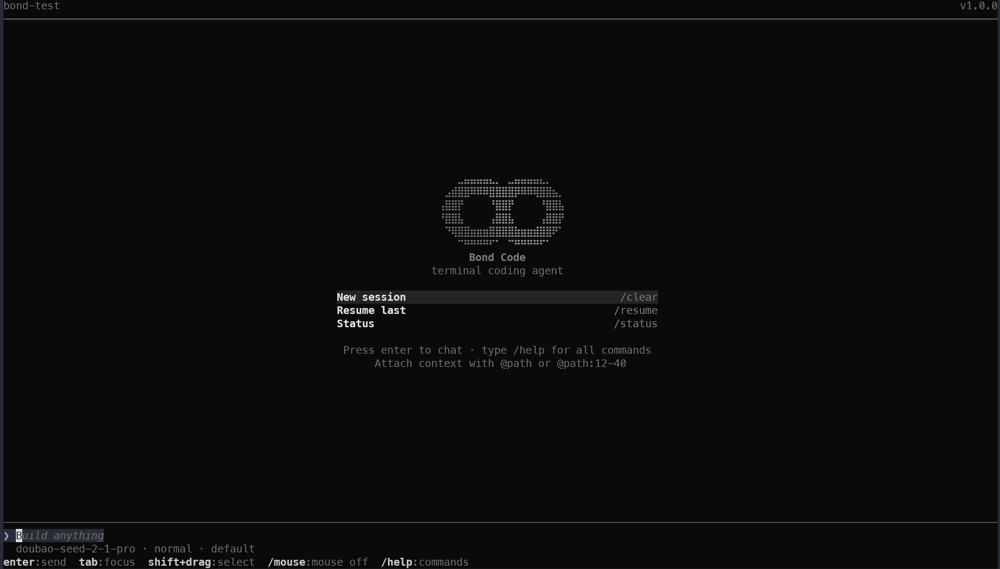

# BondCode

[English](README.md) | [中文](README.zh-CN.md)

用 Go 实现的迷你 Coding Agent。

BondCode 是一个轻量的 Coding Agent Runtime：模型通过工具（读/改/执行）完成编程任务，经安全策略确认后落地；交互界面为终端 TUI。模型接口走 Anthropic-compatible HTTP/SSE。

## 快速开始

```powershell
go install ./cmd/bondcode
bondcode
```

开发时也可以：

```powershell
go run ./cmd/bondcode
go test ./...
```

配置模型（PowerShell）：

```powershell
$env:BONDCODE_BASE_URL="https://your-endpoint/api/anthropic"
$env:BONDCODE_API_KEY="..."
$env:BONDCODE_MODEL="your-model"
```

| 环境变量 | 作用 |
|----------|------|
| `BONDCODE_BASE_URL` | Anthropic-compatible 接口地址 |
| `BONDCODE_API_KEY` | API Key |
| `BONDCODE_MODEL` | 模型名称 |

可选项目配置：从 [`configs/config.example.yaml`](configs/config.example.yaml) 复制字段到本地 `bondcode.yaml`（默认不提交）。查找顺序：`--config` → `bondcode.yaml` → `~/.bondcode/config.yaml`。

会话等状态默认落在 `~/.bondcode/projects/<编码后的cwd>/`。

## 截图与演示

### 欢迎屏



### 演示

<video src="docs/images/demo.mp4" controls width="100%"></video>

[演示视频（mp4）](docs/images/demo.mp4)

## 能做什么

- **ReAct 循环** — 选工具 → 策略/确认 → 执行 → 结构化结果回填模型
- **编程工具** — 读写文件、搜索、Shell；git / 测试等走 `run_command`
- **安全** — 风险分级；`--yes` 只自动批准 low/medium；high 仍需确认；blocked 永不执行
- **TUI** — 单栏终端工作区（细节见 reference）
- **可选能力** — 记忆、todo、skills、子 agent `task`、多 agent 协作、MCP（见配置）

## 文档

- **参考手册：** [English](docs/reference.md) · [中文](docs/reference.zh-CN.md) — 快捷键、slash、工具表、安全与能力边界
- **[configs/config.example.yaml](configs/config.example.yaml)** — 完整配置字段示例

## 许可证

以仓库元数据 / license 文件为准（若有）。
